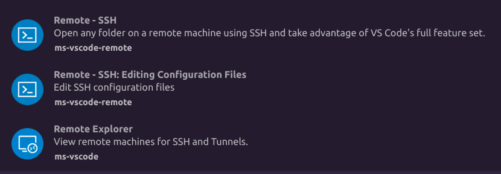

# 最适合小白入门docker教程

## 1. docker安装以及基础配置
### 1.1 安装命令
	关于安装晚上已经有很多很好的教程，大家可以看这个教程。
	https://blog.csdn.net/weixin_44355653/article/details/140267707

### 1.2 查看docker运行状态
 	sudo systemctl status docker
 	
### 1.3 查看docker配置信息
 	sudo docker info
 	
### 1.4 docker换原
 	sudo vim /etc/docker/daemon.json

### 1.5 好用的国内源
	{
	"registry-mirrors": [
		"https://docker.registry.cyou",
		"https://docker-cf.registry.cyou",
		"https://dockercf.jsdelivr.fyi",
		"https://docker.jsdelivr.fyi",
		"https://dockertest.jsdelivr.fyi",
		"https://mirror.aliyuncs.com",
		"https://dockerproxy.com",
		"https://mirror.baidubce.com",
		"https://docker.m.daocloud.io",
		"https://docker.nju.edu.cn",
		"https://docker.mirrors.sjtug.sjtu.edu.cn",
		"https://docker.mirrors.ustc.edu.cn",
		"https://mirror.iscas.ac.cn",
		"https://docker.rainbond.cc"
	]
	}
	
### 1.6 重启docker
	sudo service docker restart

## 2. docker基础命令
### 2.1 查看docker镜像
	docker image ls

### 2.2 查看docker容器
 	docker ps -a
 	
### 2.3 拉取镜像
	docker pull <image name>

### 2.4 运行容器
	docker run [Options] image
	参数说明：
		--name="名字"           指定容器名字
		-d                     后台方式运行
		-it                    使用交互方式运行,进入容器查看内容
		-p                     指定容器的端口
			-p ip:主机端口:容器端口  配置主机端口映射到容器端口
			-p 主机端口:容器端口（常用）
			-p 容器端口
		-P                     随机指定端口
		-e					   环境设置
		-v					   容器数据卷挂载
		-v /mnt/share:/mnt/share 将本地路经挂载到docker容器当中

### 2.5 将运行中的容器保存成镜像，保存我们安装的软件和环境
	docker commit <container_id> my_image:tag
	
### 2.6 删除镜像
#### 2.6.1 停止容器的运行，以该镜像运行的所有容器停止。
	docker stop <container_id>
#### 2.6.2 删除容器
	删除单个容器: docker rm <container_id>
	一下删除所有未运行的容器：docker rm $(docker ps -a -q)
#### 2.6.3 删除镜像	
	docker rmi <image_id>	
	

## 3. 联合vscode进行深度学习代码开发
### 3.1 拉取pytorch官方镜像
	docker pull pytorch/pytorch:2.1.2-cuda11.8-cudnn8-devel

### 3.2 启动拉取的环境
	docker run --gpus all -v /media/lht/LHT/Git_code:/workspace -p 8022:22 -it <image id> bash

### 3.3	更新apt源的软件列表
	apt update

### 3.4 安装vim
	apt install vim

### 3.5 安装ssh服务
	apt install openssh-server

### 3.6 设置root密码
	passwd

### 3.7 修改ssh配置文件
	vim /etc/ssh/sshd_config
	
	# 启用公钥私钥配对认证方式
	PubkeyAuthentication yes
	# 允许root用户使用ssh登录
	PermitRootLogin yes

### 3.8 重启ssh服务
	service ssh restart

### 3.9 设置开机自动启动ssh
#### 3.9.1 创建脚本文件
	touch /root/start_ssh.sh

#### 3.9.2 编辑脚本文件 
	vim /root/start_ssh.sh
	添加命令：
		#!/bin/bash
		service ssh start
#### 3.9.3 修改可执行权限
	chmod +x /root/start_ssh.sh

#### 3.9.4 添加开机自启动
	vim /root/.bashrc
	添加内容：
		# startup run
		if [ -f /root/start_ssh.sh ]; then
				/root/start_ssh.sh
		fi

### 3.10 安装vscode插件

### 3.11 配置远程连接脚本
	Host docker_mamba
		HostName 127.0.0.1
		User root
		Port 8022

### 3.12 连接docker主机
	等待vscode远程服务器安装完毕

### 3.13 连接成功保存容器
	docker commit <container_id> my_image:tag
	注意必须在操作完前面所有步骤之后再保存，这样我们就得到了一个可以使用GPU的pytorch深度学习开发环境

### 3.14 注释
	每次在docker安装软件后均需要保存成镜像存储

